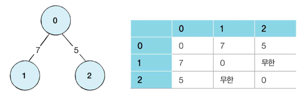

## DFS/BFS
- 탐색
  - 많은 양의 데이터 중에서 원하는 데이터를 찾는 과정이다.
  - 그래프, 트리 등의 자료구조 안에서 탐색을 하는 문제가 자주 나온다.
  - 대표적인 탐색 알고리즘으로는 DFS, BFS가 있다.
- 자료구조
  - 데이터를 표현하고 관리하고 처리하기 위한 구조이다.
  - 스택, 큐가 기초 기초 개념이다.
    - 삽입, push
    - 삭제, pop
  - 실제로 스택과 큐를 사용할 때는 오버플로와 언더플로를 고민해야 한다.
    - 오버플로: 특정한 자료구조가 수용할 수 있는 데이터의 크기를 이미 가득 찬 상태에서 삽입 연산을 수행할 때 발생한다.
    - 언더플로: 특정한 자료구조에 데이터가 전혀 들지 않은 상태에서 삭제 연산을 수행하면 얻너플로가 발생한다.

### 꼭 필요한 자료구조 기초
- 스택
  - 파이썬에서 스택을 이용할 때에는 별도의 라이브러리를 사용할 필요가 없다.
  - 기본 리스트에서 append()와 pop() 메서드를 이용하면 동일하게 동작한다.
```python
stack = []

stack.append(5)
stack.append(3)
stack.append(7)
stack.pop()
```

- 큐
  - 선입선출
  - 파이썬으로 큐를 구현할 때는 collections 모듈에서 제공하는 deque 자료구조를 활용한다.
```python
from collections import deque

queue = deque()

queue.append(5)
queue.append(2)
queue.append(3)
queue.popleft()
```

- 그래프
  - 노드(정점, Vertex)와 간선
  - 그래프의 두 가지 표현

인접 행렬: 2차원 배열로 그래프의 연결 관계를 표현하는 방식  
(모든 관계를 저장하므로 메모리가 불필요하게 낭비될 수 있다.)  
  
(출처: 이것이 취업을 위한 코딩테스트다 with 파이썬)  
```python
INF = 999999999

graph = [
  [0, 7, 5],
  [7, 0, INF],
  [5, INF, 0]
]
```

인접 리스트: 리스트로 그래프의 연결 관계를 표현하는 방식  
(데이터가 있는 연결된 데이터를 하나씩 확인해야 하기 때문에 정보를 얻는 속도가 느리다.)  

(출처: 이것이 취업을 위한 코딩테스트다 with 파이썬)  
```python
graph = [[] for _ in range(3)]

graph[0].append((1, 7))
graph[0].append((2, 5))

graph[1].append((0, 7))

graph[2].append((0, 5))
```

### 탐색 알고리즘 DFS/BFS
- DFS
  - Depth-First Search
  - 깊이 우선 탐색
  - 스택 자료구조를 이용한다.
```python
def dfs(graph, v, visited):
    visited[v] = True
    for i in graph[v]:
        if not visited[v]:
            dfs(graph, i, visited)

graph = [
  [], 
  [2, 3, 8],
  [1, 7],
  [1, 4, 5],
  [3, 5],
  [3, 4],
  [7],
  [2, 6, 8],
  [1, 7]
]

visited = [False] * 9
dfs(graph, 1, visited)
```

- BFS
  - 너비 우선 탐색
  - 가까운 노드부터 탐색하는 알고리즘이다.
  - 큐 자료구조를 이용한다.
```python
from collections import deque

def bfs(graph, start, visited):
    queue = deque([start])
    visited[start] = True
    while queue:
        v = queue.popleft()
        for i in graph[v]:
            if not visited[i]:
                queue.append(i)
                visited[i] = True

graph = [
  [], 
  [2, 3, 8],
  [1, 7],
  [1, 4, 5],
  [3, 5],
  [3, 4],
  [7],
  [2, 6, 8],
  [1, 7]
]

visited = [False] * 9
bfs(graph, 1, visited)
```

### 문제 - 음료수 얼려 먹기
- 문제 설명
  - N X M 얼음통
  - 구멍이 뚫려있으면 0, 칸막이가 존재하면 1
  - 구멍이 뚫려있는 부분끼리 상,하,좌,우로 붙어있는 경우 서로 연결되어 있는 것으로 간주한다.
  - 총 아이스크림의 개수
  - 입력
    - 세로 n, 가로 m
    - 얼음틀의 형태
  - 출력
    - 한 번에 만들 수 있는 아이스크림의 개수
- 문제 해설
  - 특정 지점 주변의 상,하,좌,우를 살펴본 후에 방문하지 않은 지점이 있다면 해당 지점을 방문한다.
  - 방문처리는 visited를 따로 사용하지 않고 graph[x][y]로 처리할 수 있다.

### 문제 - 미로 탈출
- 문제 설명
  - N X M 크기의 직사각형 형태의 미로에 갇혀있다.
  - 위치는 (1, 1), 미로의 출구는 (N, M)
  - 괴물이 있는 부분은 0, 괴물이 없는 부분은 1
  - 동빈이가 탈출하기 위해 움직여야 하는 최소 칸의 개수
- 문제 해설
  - 