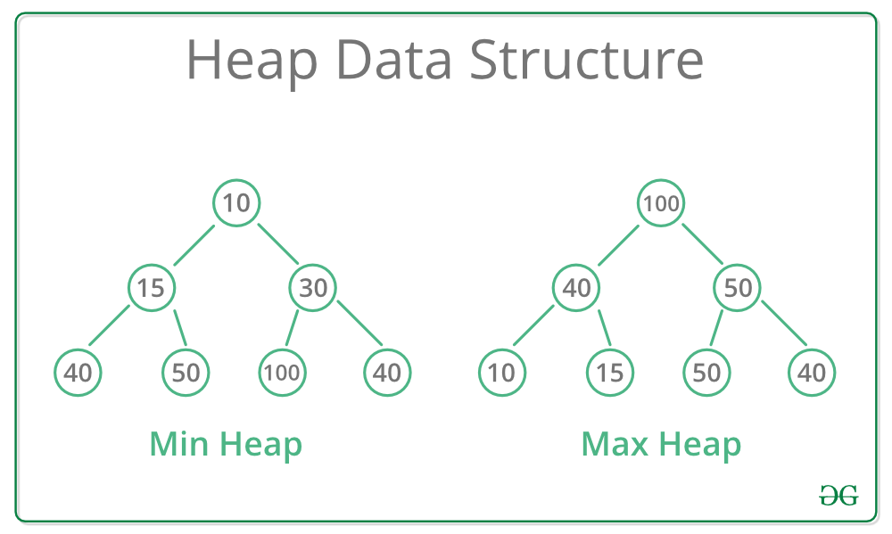

### 표준 라이브러리
파이썬에서 지원하는 표준 라이브러리는 굉장히 다양하지만, 코테를 준비하면서 반드시 알아야하는 라이브러리는 다음과 같다.  

| 이름         | 설명                                                 |
|------------|----------------------------------------------------|
| 내장함수       | print(), input(): 기본 입출력 기능<br> sorted(): 정렬 기능    |
| itertools  | 반복되는 형태의 데이터를 처리하는 라이브러리<br> 예시) 순열과 조합            |
| heapq      | 힙 기능을 제공하는 라이브러리, 우선순위 큐 기능 구현                     |
| bisect     | 이진탐색 기능을 제공하는 라이브러리                                |
| collections | deque, counter 등 유용한 자료구조를 포함하는 라이브러리              |
| math       | 수학적 기능을 제공하는 라이브러리<br> 팩토리얼, 제곱근, 최대공약수, 삼각함수, 파이 등 |

### 내장함수
```python
sum([1, 2, 3, 4, 5])
min([1, 2, 3, 4, 5])
max([1, 2, 3, 4, 5])
eval("(3 + 5) * 7") # 문자열로 들어온 수식 결과 반환
sorted([9, 1, 8, 5, 4]) # 리스트 정렬
sorted([('홍길동', 35), ('이순신', 75), ('아무개', 50)], key = lambda x: x[1], reverse=True) # 원소를 튜플의 두 번째 원소를 기준으로 내림차순
array.sort()
```

### itertools
```python
from itertools import permutations, combinations, product, combinations_with_replacement

data = ['A', 'B', 'C']
result = list(permutations(data, 3)) # 리스트에서 3개 뽑아서 나열
result = list(combinations(data, 2)) # 리스트에서 2개 뽑아 조합
result = list(product(data, 2)) # 리스트에서 2개 뽑아 나열, 중복 O
result = list(combinations_with_replacement(data, 2)) # 리스트에서 2개 뽑아 조합, 중복 O
```

### heapq

최소 힙으로 구현되어 있어서 단순히 원소를 전부 넣었다가 빼는 것 만으로도 시간 복잡도 O(NlogN)에 오름차순 정렬이 완료된다.

```python
import heapq

h = []
heapq.heappush(h, 1) # 힙에 원소 삽입
heapq.heappop(h) # 힙에서 원소 꺼내기
```

최대 힙 구현하기
```python
import heapq

def heapsort(iterable):
    h = []
    result = []
    
    for value in iterable:
        heapq.heappush(h, -value)
    for i in range(len(h)):
        result.append(-heapq.heappop(h))
    return result
```

### bisect
- **이진 탐색**을 쉽게 구현할 수 있도록 한 라이브러리이다.
- '정렬된 배열'에서 특정한 원소를 찾아야 할 때 매우 효과적으로 사용된다.
- bisect_left(), bisect_right()의 시간복잡도는 O(logN)이다.
- **bisect_left()**: 정렬된 순서를 유지하면서 리스트 a에 데이터 x를 삽입할 가장 왼쪽 인덱스를 찾는다.
- **bisect_right()**: 정렬된 순서를 유지하면서 리스트 a에 데이터 x를 삽입할 가장 오른쪽 인덱스를 찾는다.
```python
from bisect import bisect_left, bisect_right

a = [1, 2, 4, 4, 8]
x = 4

print(bisect_left(a, x)) # 2
print(bisect_right(a, x)) # 4
```

### collections
- deque
  - 보통 파이썬에서는 deque를 사용해서 큐를 구현한다.
  - 원소를 삽입하거나 삭제할 때 시간 복잡도는 O(1)이다.

| 함수           | 역할           |
|--------------|--------------|
| popleft()    | 첫 번째 원소 제거   |
| pop()        | 마지막 원소 제거    |
| appendleft() | 첫 번째 인덱스에 삽입 |
| append()     | 마지막 인덱스에 삽입  |

> 큐 자료구조로 deque를 이용할 때 원소를 삽입할 때는 append(), 삭제할 때는 popleft()를 사용하면 된다.

- Counter
  - 등장 횟수를 세는 기능을 제공한다.
  - 리스트와 같은 반복 가능한 객체가 주어졌을 때 내부의 원소가 몇 번씩 등장했는지를 알려준다.
```python
from collections import Counter

counter = Counter(['red', 'blue', 'red', 'green', 'blue', 'blue'])
print(counter['blue']) # 3
print(dict(counter)) # {'red': 2, 'blue': 3, 'green': 1}
```

### math
- 수학적 기능을 포함하고 있는 라이브러리이다.
- 팩토리얼, 제곱근, 최대공약수(gcd) 등을 계산해주는 기능을 포함한다.

```python
import math

math.factorial(5)
math.sqrt(7) # 7의 제곱근
math.pi
math.e # 자연상수 e
```

- 최대공약수: gcd()
```python
import math

def lcm(a, b):
    return a * b // math.gcd(a, b)

print(math.gcd(21, 14)) # 최대 공약수 gcd
print(lcm(21, 14))
```